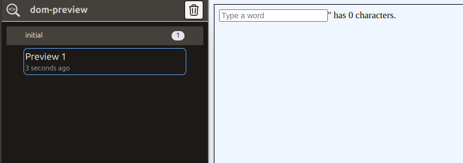
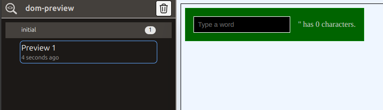
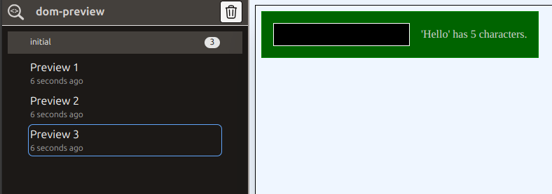
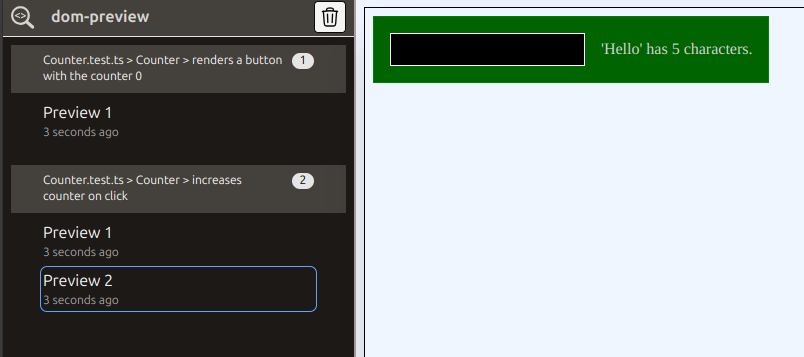
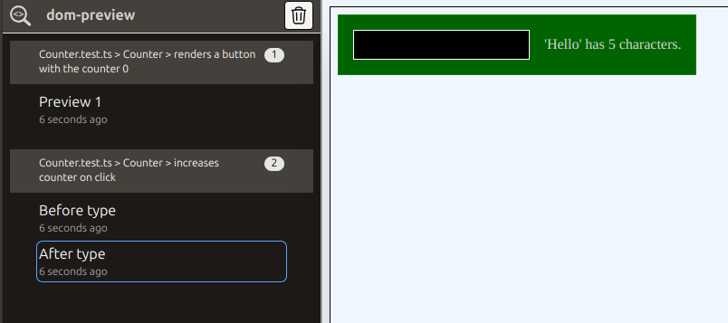

<script setup>
import NpmLink from './components/NpmLink.vue';
import Counter from './examples/Counter.vue'; 
</script>

# Getting started

This page describes how to get started with <NpmLink package="dom-preview" />

## Installation

In order to install `dom-preview` type.

```bash
npm install --save-dev dom-preview
```

::: info
`dom-preview` is framework-agnostic. This means that you have to adjust some configuration
for each framework. In the following examples, we are using <NpmLink package="vitest" />,
<NpmLink package="jsdom" /> and <NpmLink package="vue" /> to show the configuration.

This is a step-by-step walk-though that will show you how `dom-preview` is intended to be used,
which pitfalls my appear on the way and how to solve them.
:::

In order to use `dom-preview`, the component under test needs to be rendered in a way that their
dom elements are accessible via the global `window` object.

I highly recommend, that you use the [Testing Library](https://testing-library.com/) to write your tests.
Not only because it attaches components to the DOM, but also because it provides an interface
to make tests more realistic and stable.

For the examples, we will use the following component

<<< @/examples/Counter.vue

<Counter />

## Basic usage

**Start the server**

```bash
npx dom-preview
```

The web-frontend of dom-preview now runs on <a href="http://localhost:5007/__dom-preview__/">`http://localhost:5007/__dom-preview__/`</a>

**Add a `debug` statement to your test.**

<<< @/examples/no-css/Counter.test.ts

The `dom-preview` UI will now look like this:



You can use the dev-tools to inspect the DOM, but ths component still looks different compared to
the actual one.

## Configure tests to emit CSS

This happens when the tests don't emit CSS. In <NpmLink package="vitest" />, you have to add
the property `css: true` the vitest config:

<<< @/examples/with-css/vitest.config.ts

If we run the tests now, the result looks much better:



## Multiple DOM-previews

Now assume that we have written multiple tests and done some user interactions which all change the
DOM. You can put multiple `debug()` statements into your code.

<<< @/examples/no-context/Counter.test.ts#test

Each preview will be collected and displayed.



As you can see, all previews are shown in the category "initial" and labeled with increasing
numbers. This can be confusing if you have a lot of previews.

We tell `dom-preview` to use another name instead of "initial". The name of the current test would be nice.
In `vitest` you can get this name via `expect.getState().currentTestName`. We can add a `setupFile`
to the vitest config to set the current preview context before each test:

**vitest.config.ts**

<<< @/examples/with-context/vitest.config.ts

**setupTests.ts**

<<< @/examples/with-context/setupTests.ts

When we run the tests now, we will get the following output:



## Labels

You can also add labels to debug calls, in order to locate them more easily:

<<< @/examples/no-context/Counter.test.ts#test

The parameter of the debug function will be displayed as name in the ui:


